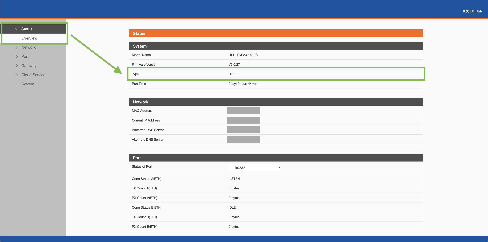
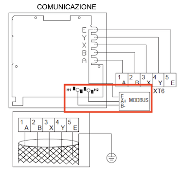
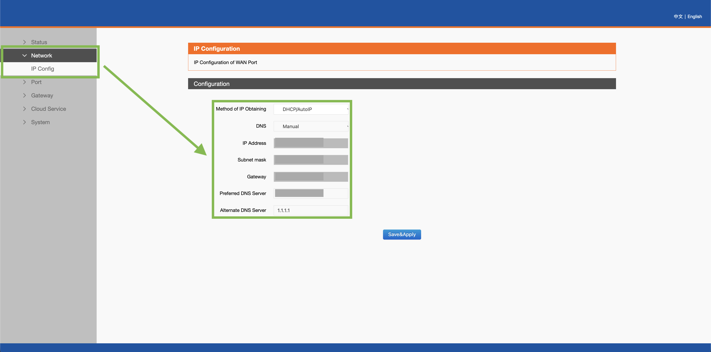
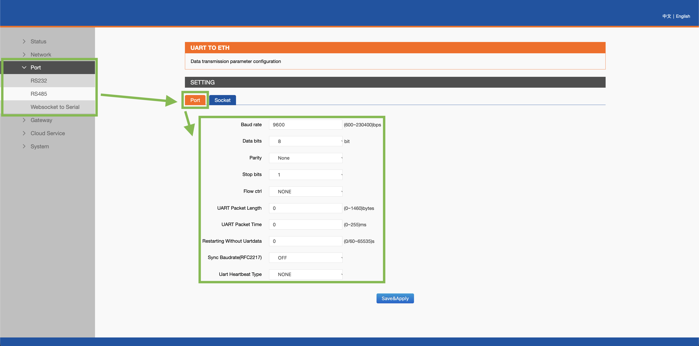
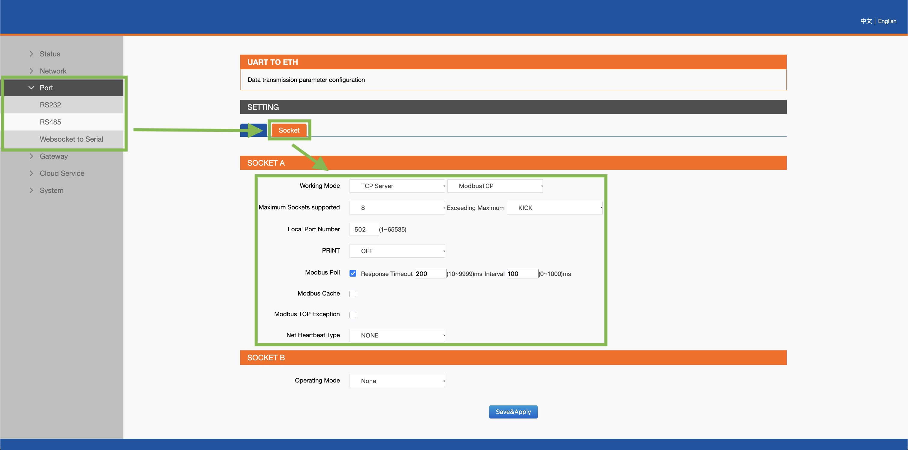
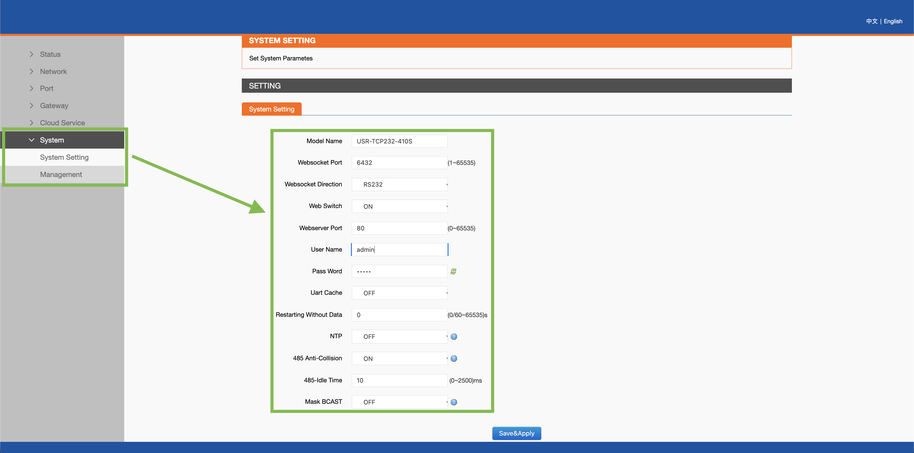
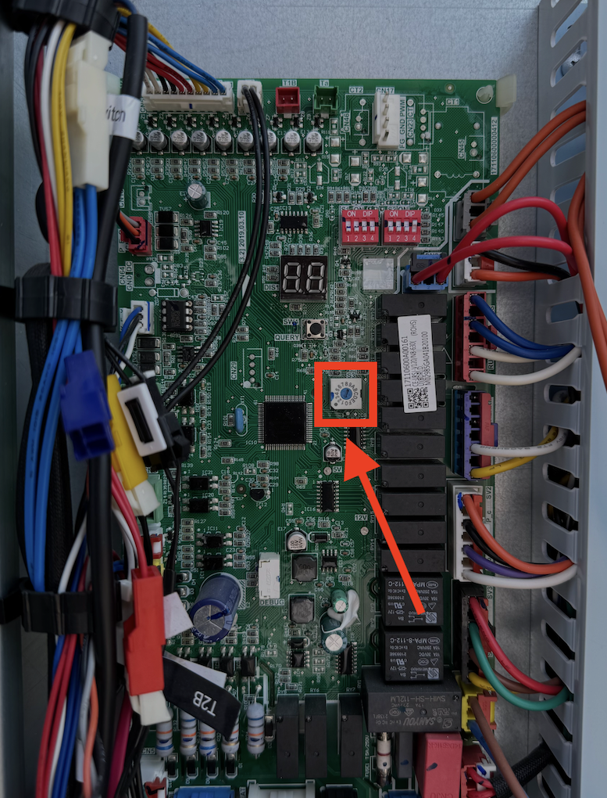

# Baxi Auriga heat pump 

## Descrizione dei termini
| Sigla               | Elemento                         | Significato pratico (Per l'utente)                                                                                                                               |
| :---                | :---                             | :---                                                                                                                                                             |
| **T4**              | Temperatura esterna              | Temperatura dell'aria esterna                                                                                                                                    |
| **T5**              | Temperatura Acqua Calda Sanitaria| Temperatura dell'acqua presente nel boiler                                                                                                                       |
| **T1S**             | Temperatura Obiettivo (Setpoint) | Temperatura a cui la macchina sta cercando di portare l'acqua dell'impianto                                                                                      |
| **TW_out** / **T1** | Temperatura acqua in uscita      | Temperatura reale dell'acqua che esce dalla pompa di calore e viaggia verso i termosifoni o il pavimento radiante                                                |
| **TW_in**           | Temperatura acqua di ritorno     | Acqua che "torna indietro" dalla casa alla pompa di calore, dopo aver rilasciato il suo caldo (o freddo) nelle stanze                                            |
| **T1B**             | Temperatura acqua Zona 2         | Se si ha l'impianto diviso in due, questa è la temperatura dell'acqua mandata alla seconda zona                                                                  |
| **AHS**             | Caldaia di supporto              | Se si ha un impianto ibrido, indica la caldaia tradizionale (es. a gas). Si accende solo per dare una mano quando fuori fa un freddo estremo                     |
| **IBH1 / IBH2**     | Resistenze elettriche (Casa)     | Riscaldatori elettrici di emergenza. Si accendono in automatico per aiutare a scaldare la casa se la pompa di calore non ce la fa da sola                        |
| **TBH**             | Resistenza elettrica (Doccia)    | Riscaldatore elettrico immerso nel boiler. Si usa per scaldare l'acqua sanitaria molto in fretta o per il ciclo mensile di disinfezione termica (antilegionella) |
| **T2 / T2B**        | Sensori Gas Refrigerante         | *(Dato tecnico)*: Misurano lo stato del gas freon dentro i tubi                                                                                                  |
| **T3**              | Sensore Batteria Esterna         | *(Dato tecnico)*: Serve alla macchina per capire se si è formato del ghiaccio sull'unità esterna in inverno (per avviare lo sbrinamento)                         |
| **Th / Tp**         | Sensori del Compressore          | *(Dato tecnico)*: Indicano le temperature del motore                                                                                                             |
| **Pe**              | Pressione Gas                    | *(Dato tecnico)*: Indica a che pressione sta lavorando l'impianto. Utile per capire se c'è una perdita di gas                                                    |

## Mappa dei sensori e registri modbus
Di seguito viene riportato l'elenco di tutti i sensori acquisiti via modbus
 
La colonna **Accesso** indica se un'entità è di sola lettura (**R**) oppure se può anche essere comandata (**R-W**, lettura e scrittura). Per leggere o comandare una funzione, usare direttamente l'entità indicata: ad esempio, per lo stato della valvola SV1 si usa `binary_sensor.load_sv1`, per impostare la temperatura dell'acqua in riscaldamento si usa `number.setting_heating_water_temperature`.
 
### Comandi e impostazioni
 
| Entità | Accesso | Descrizione / Valori |
| :--- | :---: | :--- |
| `select.setting_operating_mode` | R-W | Modalità: Auto / Raffrescamento / Riscaldamento |
| `number.setting_heating_water_temperature` | R-W | Setpoint acqua riscaldamento (20-60 °C) |
| `number.setting_cooling_water_temperature` | R-W | Setpoint acqua raffrescamento (5-25 °C) |
| `number.setting_domestic_hot_water_temperature` | R-W | Setpoint accumulo ACS T5s (40-60 °C) |
| `select.heating_curve_selection` | R-W | Curva climatica riscaldamento: Non attiva / 1-8 |
| `select.cooling_curve_selection` | R-W | Curva climatica raffrescamento: Non attiva / 1-8 |
| `select.setting_silent_mode` | R-W | Modalità silenziosa: Non attivo / Livello 1 / Livello 2 |
| `switch.silent_mode` | R-W | Modalità silenziosa on/off rapido (solo BIT6) *(vedi nota doppioni)* |
| `switch.climate_curve` | R-W | Curva climatica attiva/non attiva (solo BIT12) *(vedi nota doppioni)* |
| `switch.disinfect` | R-W | Disinfezione termica (antilegionella) |
| `switch.eco_mode` | R-W | Modalità Eco |
| `switch.dhw_water_recycling` | R-W | Ricircolo pompa acqua calda sanitaria |
| `sensor.setting_air_temperature` | R | Setpoint temperatura aria Ts (17-30 °C) |
| `sensor.forced_water_heating` | R | Riscaldamento acqua forzato (0: Invalido, 2: ON, 3: OFF) |
| `sensor.forced_electric_water_tank_heater` | R | Resistenza accumulo (TBH) forzata (0: Invalido, 2: ON, 3: OFF) |
| `sensor.forced_electric_heater` | R | Resistenza integrativa (IBH) forzata (0: Invalido, 2: ON, 3: OFF) |
 
> **Nota sui doppioni (silent mode e curva climatica).** Lo `switch.silent_mode` e il `select.setting_silent_mode` agiscono sullo stesso registro 5: lo switch comanda solo l'accensione (BIT6), il select comanda accensione + livello (BIT6+BIT7). Analogamente `switch.climate_curve` e i due select delle curve agiscono sul BIT12. Tenere sia switch che select è possibile (comodo per un on/off rapido senza scegliere il livello) e **non danneggia i registri**, ma le due entità possono mostrare stati leggermente diversi e, se azionate a pochi secondi di distanza, dare luogo a scritture basate su un valore non ancora aggiornato. Se si preferisce la massima coerenza, tenere solo i select.
 
### Temperature e pressioni
 
| Entità | Accesso | Descrizione / Valori |
| :--- | :---: | :--- |
| `sensor.outdoor_ambient_temperature` | R | `°C` T4 - Temperatura aria esterna |
| `sensor.room_temperature` | R | `°C` Ta - Temperatura ambiente letta |
| `sensor.water_inlet_temperature` | R | `°C` TW_in - Acqua di ritorno (ingresso pompa) |
| `sensor.water_outlet_temperature` | R | `°C` TW_out - Acqua in uscita |
| `sensor.total_water_outlet_temperature` | R | `°C` T1 - Temperatura totale uscita acqua |
| `sensor.total_water_outlet_temperature_behind_the_auxiliary_heater` | R | `°C` T1B - Acqua dopo riscaldatore ausiliario |
| `sensor.domestic_hot_water_tank_temperature` | R | `°C` T5 - Temperatura accumulo ACS |
| `sensor.condenser_temperature` | R | `°C` T3 - Temperatura condensatore |
| `sensor.discharge_temperature` | R | `°C` Tp - Mandata compressore |
| `sensor.return_air_temperature` | R | `°C` Th - Aspirazione compressore |
| `sensor.refrigerant_liquid_side_temperature` | R | `°C` T2 - Refrigerante lato liquido |
| `sensor.refrigerant_gas_side_temperature` | R | `°C` T2B - Refrigerante lato gas |
| `sensor.inverter_module_temperature` | R | `°C` TF - Temperatura modulo inverter |
| `sensor.hydraulic_module_curve_t1s_calculated_value_1` | R | `°C` Valore T1S calcolato (zona 1) |
| `sensor.hydraulic_module_curve_t1s_calculated_value_2` | R | `°C` Valore T1S calcolato (zona 2) |
| `sensor.outdoor_unit_high_pressure` | R | `kPa` Alta pressione unità esterna |
| `sensor.outdoor_unit_low_pressure` | R | `kPa` Bassa pressione unità esterna |
 
### Funzionamento ed energia
 
| Entità | Accesso | Descrizione / Valori |
| :--- | :---: | :--- |
| `sensor.operating_mode` | R | Stato operativo (0: Off, 2: Raffrescamento, 3: Riscaldamento) |
| `sensor.compressor_operating_frequency` | R | `Hz` Frequenza compressore |
| `sensor.unit_target_frequency` | R | `Hz` Frequenza target compressore |
| `sensor.fan_speed` | R | `rpm` Velocità ventilatore |
| `sensor.electronic_expansion_valve_openness` | R | Apertura valvola di espansione (multipli di 8) |
| `sensor.water_flow` | R | `m³/h` Portata acqua |
| `sensor.ability_of_hydraulic_module` | R | `kW` Potenza resa modulo idronico |
| `sensor.outdoor_unit_operating_current` | R | `A` Corrente assorbita unità esterna |
| `sensor.outdoor_unit_voltage` | R | `V` Tensione unità esterna |
| `sensor.dc_bus_current` | R | `A` Corrente bus DC |
| `sensor.dc_bus_voltage` | R | `V` Tensione bus DC |
| `sensor.limit_outdoor_unit_current` | R | `A` Limite corrente unità esterna |
| `sensor.compressor_operating_time` | R | `h` Ore funzionamento compressore |
| `sensor.current_fault` | R | Codice errore attuale |
| `sensor.hydraulic_module_version_number` | R | Versione modulo idronico |
| `sensor.wired_controller_version_number` | R | Versione comando a filo |
 
### Stato uscite / carichi (Load output)
 
| Entità | Accesso | Descrizione |
| :--- | :---: | :--- |
| `binary_sensor.load_run` | R | Unità in funzione (RUN) |
| `binary_sensor.load_defrost` | R | Sbrinamento in corso |
| `binary_sensor.load_alarm` | R | Allarme attivo |
| `binary_sensor.load_ibh1_electric_heater` | R | Resistenza elettrica IBH1 |
| `binary_sensor.load_tbh_electric_heater` | R | Resistenza elettrica TBH (accumulo) |
| `binary_sensor.load_external_heater` | R | Resistenza esterna |
| `binary_sensor.load_water_pump_pump_i` | R | Pompa acqua PUMPI |
| `binary_sensor.load_external_water_pump_p_o` | R | Pompa acqua esterna P_o |
| `binary_sensor.load_water_return_pump_p_d` | R | Pompa ricircolo P_d |
| `binary_sensor.load_mixed_water_pump_p_c` | R | Pompa acqua miscelata P_c |
| `binary_sensor.load_solar_water_pump` | R | Pompa acqua solare |
| `binary_sensor.load_sv1` | R | Valvola SV1 |
| `binary_sensor.load_sv2` | R | Valvola SV2 |
| `binary_sensor.load_heat4` | R | HEAT4 |
 
### Stato macchina (Status bit 1)
 
| Entità | Accesso | Descrizione |
| :--- | :---: | :--- |
| `binary_sensor.status_defrost` | R | Sbrinamento |
| `binary_sensor.status_antifreeze` | R | Antigelo |
| `binary_sensor.status_oil_return` | R | Ritorno olio |
| `binary_sensor.status_remote_on_off` | R | Remote On/Off |
| `binary_sensor.status_outdoor_unit_test` | R | Segnale test unità esterna |
| `binary_sensor.status_thermostat_heating` | R | Termostato (riscaldamento) |
| `binary_sensor.status_thermostat_cooling` | R | Termostato (raffrescamento) |
| `binary_sensor.status_solar_input` | R | Input solare |
| `binary_sensor.status_sg_signal` | R | Segnale SG (on = tariffa normale, off = prezzo alto) |
| `binary_sensor.status_evu_signal` | R | Segnale EVU (on = elettricità gratis, off = valuta segnale SG) |
 
---
 
### Entità interne (uso di servizio)
 
Queste entità contengono i valori "grezzi" dei registri e servono ad alimentare le entità decodificate qui sopra. Normalmente non si usano direttamente.
 
| Entità | Registro | Descrizione |
| :--- | :--- | :--- |
| `sensor.system_power_state` | 0 | Stato accensione grezzo (vedi nota sul registro 0) |
| `sensor.setting_mode` | 1 | Modalità impostata (grezza) |
| `sensor.setting_water_temperature_t1s_raw` | 2 | Setpoint T1s grezzo (byte basso risc., byte alto raffr.) |
| `sensor.function_setting_raw` | 5 | Bitmask funzioni speciali |
| `sensor.curve_selection_raw` | 6 | Curva grezza (byte basso risc., byte alto raffr.) |
| `sensor.status_bit_1` | 128 | Bitmask stato macchina |
| `sensor.load_output` | 129 | Bitmask uscite di carico |
 
> **Nota sul registro 0.** `sensor.system_power_state` è un registro di comando: in lettura **non riflette** necessariamente lo stato reale se le funzioni vengono accese dallo schermo della pompa o dal comando cablato. Per sapere cosa è realmente attivo usare `sensor.operating_mode` (registro 101) e i `binary_sensor.load_*` (registro 129). Nota inoltre che il compressore fermo non significa "funzione disattivata": ad esempio con ACS attiva ma acqua già scaldata dal solare termico, il compressore resta spento pur essendo la produzione ACS abilitata.

---

# Gateway USR-TCP232-410S-H7 
La serie USR-TCP232-410s esiste in **quattro varianti hardware**, rilasciate in sequenza: **M4**, **HB**, **RT** e **H7**. Sono esteticamente identiche e i rivenditori le vendono quasi sempre come "410s" generico, senza specificare il suffisso. Le differenze però sono sostanziali.
 
| Caratteristica             | M4        | HB        | RT        | H7        |
|---                         |:---:      |:---:      |:---:      |:---:      |
| Processore                 | Cortex-M4 | Cortex-M7 | Cortex-M7 | Cortex-M7 |
| Frequenza                  | 120 MHz   | 400 MHz   | 400 MHz   | 400 MHz   |
| Conversione Modbus TCP/RTU | SI        | SI        | SI        | SI        |
| Edge Computing             | NO        | NO        | NO        | SI        |
| MQTT                       | NO        | NO        | NO        | SI        |
| JSON                       | NO        | NO        | NO        | SI        |
| SSL/TLS                    | NO        | NO        | NO        | SI        |
| 485 Anti-Collision         | NO        | NO        | NO        | SI        |
| NTP                        | NO        | NO        | NO        | SI        |
 
Ho scelto la variante **H7** per tre motivi concreti legati al mio impianto — non per il generico "ha più funzioni":
1. **485 Anti-Collision**: è la funzione decisiva. Il bus RS485 della pompa di calore è **condiviso con il comando cablato** della macchina. Questa funzione impedisce al gateway di trasmettere mentre il bus è occupato dal comando cablato, prevenendo le collisioni che causano errori di comunicazione intermittenti. È l'unica variante che ce l'ha, ed è mirata esattamente a questo scenario.
2. **MQTT con scrittura registri**: se in futuro vorrò disaccoppiare il polling da Home Assistant, la H7 può fare da gateway MQTT completo (legge i registri, pubblica in JSON, riceve comandi di scrittura).
3. **Edge computing**: permette al gateway di interrogare autonomamente la pompa e restituire i dati già impacchettati, alleggerendo Home Assistant.
 
Sul web la variante non è quasi mai specificata, e la variante fisica non è sempre stampata in modo leggibile sul dispositivo. Il metodo sicuro è leggere la versione firmware dalla web UI seguendo il percorso: **Status → Overview → Type**.

La corrispondenza è inequivocabile:

 
Consiglio di acquistare da un venditore con reso facile e specificare per iscritto nell'ordine che si vuole la versione H7. Alla consegna, verificare il tipo prima di installarlo.


## Collegamento fisico
- **Alimentazione**: 5–36 V DC (alimentatore in dotazione). Il modulo non è PoE.
- **Ethernet**: dal modulo al router.
- **RS485 verso la pompa** (collegare dopo aver configurato il modulo):
  - **A +** → **H2** sul PCB del comando cablato
  - **B −** → **H1** sul PCB del comando cablato
  - **E** → connessione earth (opzionale, con cavo schermato collegare la schermatura da un solo lato per evitare loop di massa)
Il comando cablato deve restare collegato al modulo idraulico, altrimenti i registri non rispondono.
 



## Accesso alla web UI
Il modulo esce con IP statico di fabbrica **192.168.0.7** (utente/password: **admin/admin**).
- Se la propria rete è già `192.168.0.x` → aprire `http://192.168.0.7`.
- Altrimenti usare il tool ufficiale **EthernetTool** (scaricabile dal sito PUSR), che trova il modulo via broadcast anche su sottorete diversa, oppure cercare il nuovo dispositivo nella lista client del router.


## Configurazione di rete (Network → IP Config) 
Il modulo di default può essere in **DHCP/AutoIP** e prendere un IP dal router, ma in DHCP l'IP potrebbe cambiare a un riavvio del router, e Home Assistant perderebbe il contatto (nel file YAML l'IP è fisso).
 
**Cosa fare** — una delle due:
- Impostare **Method of IP Obtaining → Static IP** e fissare un IP libero della propria rete, **oppure**
- Lasciare DHCP e fare una **reservation** sul router (IP legato al MAC del modulo). 
  *Soluzione consigliata*: si gestisce tutto da un punto solo.
 
### DNS
Nella stessa pagina compaiono due DNS di default: **114.114.114.114** e **223.5.5.5**. Sono **DNS pubblici cinesi** (114DNS e AliDNS), preimpostati dal produttore perché il dispositivo è di origine cinese.
 
**Nel setup Modbus TCP locale questi DNS sono irrilevanti**: il modulo comunica con Home Assistant tramite **indirizzo IP diretto**, non tramite nomi di dominio, quindi non deve risolvere nulla. Il DNS servirebbe solo per raggiungere server cloud tramite nome — esattamente ciò che **non** voglio.
 
Si possono lasciare così senza problemi. Per pulizia, passando a IP statico si possono sostituire con il DNS del proprio router (es. `192.168.x.1`) o un DNS neutro (es. `1.1.1.1`). È una scelta puramente estetica, non cambia il funzionamento.



Cliccare **Save&Apply**.


## Parametri seriali (Port → RS485 → Port)
Impostare i parametri seriali identici a quelli del dispositivo Modbus 
(per la Baxi Auriga: **9600-8-N-1**):

| Campo                       | Valore | Note                |
|---                          |---     |---                  |
| Baud rate                   | 9600   | Il default è 115200 |
| Data bits                   | 8      |                     |
| Parity                      | None   |                     |
| Stop bits                   | 1      |                     |
| Flow ctrl                   | NONE   |                     |
| UART Packet Length          | 0      | default             |
| UART Packet Time            | 0      | default             |
| Restarting Without Uartdata | 0      | disattivato         |
| Sync Baudrate (RFC2217)     | OFF    | Il default è ON     |
| Uart Heartbeat Type         | NONE   |                     |

**Perché disattivare Sync Baudrate (RFC2217)?**: questa funzione permette a un software di rete di cambiare al volo i parametri seriali inviando un pacchetto speciale. Con Modbus non serve e potrebbe alterare il baud rate in modo indesiderato. Meglio bloccarlo su OFF così il baud rate resta fisso.
 


Cliccare **Save&Apply**.


## Modalità Modbus TCP (Port → RS485 → Socket) 
Questa è la parte più importante: attiva la conversione da Modbus TCP (lato rete) a Modbus RTU (lato seriale), che permette di usare `type: tcp` pulito in Home Assistant.
 
| Campo                     | Valore     | Note                                           |
|---                        |---         |---                                             |
| Working Mode (1° menu)    | TCP Server |                                                |
| Working Mode (2° menu)    | Modbus TCP | Il default è "None"                            |
| Local Port Number         | 502        | Il default è 26                                |
| Maximum Sockets supported | 8          | Default                                        |
| Exceeding Maximum         | KICK       | Default                                        |
| PRINT                     | OFF        |                                                |
| Modbus Poll               | SI         | Attiva il polling Modbus                       |
| → Response Timeout        | 200 ms     |                                                |
| → Interval                | 50–100 ms  | Consigliato, per dare respiro al bus condiviso |
| Modbus Cache              | NO         | Non memorizzare valori                         |
| Modbus TCP Exception      | NO         | Vedi nota sotto                                |
| Net Heartbeat Type        | NONE       |                                                |
| SOCKET B → Operating Mode | None       | non serve                                      |
 
**Modbus TCP Exception**: in fase di **debug iniziale** può essere utile attivarlo temporaneamente: fa sì che Home Assistant riceva i codici di errore Modbus (es. "illegal address") invece di un timeout generico, aiutando a capire perché un registro non risponde. A regime si può lasciare OFF.


 
Cliccare **Save&Apply**.

 
## Impostazioni di sistema (System → System Setting)
 
| Campo                   | Valore | Note                                     |
|---                      |---     |---                                       |
| 485 Anti-Collision      | ON     | il default è OFF                         |
| → 485 Idle Time         | 10 ms  |                                          |
| NTP                     | OFF    | non serve per il Modbus TCP diretto      |
| Mask BCAST              | OFF    |                                          |
| Uart Cache              | OFF    | come Modbus Cache: no valori memorizzati |
| Restarting Without Data | 0      | disattivato                              |
| Web Switch              | ON     | lasciare ON per accedere alla web UI     |
| Webserver Port          | 80     |                                          |
| Pass Word               | admin  | consigliato cambiarla                    |



Cliccare **Save&Apply**.

 
## Isolamento dal cloud (Cloud Service + regola router)
Per garantire che il modulo resti **completamente locale**, servono due livelli di protezione complementari.
 
### Livello 1 — Disattivare le funzioni cloud nella web UI
Nel menu **Cloud Service** (e nelle relative sottosezioni) disattivare:
- **DM Cloud / PUSR Cloud** → OFF
- **MQTT** (se non usato) → OFF
- **HTTPD Client** → OFF
- ogni altra connessione a server remoti

Questo dice al modulo di non tentare connessioni verso l'esterno.
 
### Livello 2 — Regola sul router (blocco WAN)
Sul router, creare una regola che **nega l'accesso a internet (WAN)** all'IP del modulo, lasciando intatta la comunicazione **LAN**. Consigliato agganciare la regola al **MAC address** del modulo (o prima fare una reservation DHCP e poi bloccare l'IP ormai stabile), così resta valida anche se l'IP cambiasse.
 
Questo impedisce fisicamente al modulo di raggiungere internet, a prescindere dalle sue impostazioni interne.

---
 
# Configurazione lato Home Assistant
L'integrazione è organizzata con il sistema dei `package` di Home Assistant, così tutto ciò che riguarda la pompa di calore Baxi resta raccolto in un unico punto, separato dal resto della configurazione.

```
/config/
├── configuration.yaml           # attiva i package (vedi sotto)
└── packages/
    └── auriga_modbus.yaml       # tutta la configurazione Baxi
```

Perché Home Assistant carichi la cartella `packages/`, in `configuration.yaml` deve essere presente la riga:

```yaml
homeassistant:
  packages: !include_dir_named packages
```

Note importanti:
- La chiave `homeassistant:` deve comparire **una sola volta** nel file. Se esiste già (di solito c'è di default), va aggiunta solo la riga `packages: ...` al suo interno con l'indentazione corretta (2 spazi), senza creare un secondo blocco `homeassistant:`.
- La cartella deve chiamarsi **esattamente** `packages` e trovarsi in `/config/packages/`, perché `!include_dir_named packages` la cerca lì.

Il file del package contiene l'hub Modbus con, al suo interno, l'intera lista dei sensori:

```yaml
modbus:
  - name: DEVICE_NAME
    type: tcp
    host: IP_ADDRESS
    port: 502
    delay: 5
    message_wait_milliseconds: 100
    sensors:
      - name: ...
        address: ...
        ...
      # ... tutti gli altri sensori ...
```
> Con la conversione **Modbus TCP** attiva sul gateway, si usa `type: tcp`. Se invece si usasse solo il *transparent transmission* (senza conversione), servirebbe `type: rtuovertcp`.

Verifica dopo le modifiche:
1. **Strumenti per sviluppatori → Controlla configurazione**: deve restituire "Configurazione valida".
2. **Riavviare** Home Assistant (le modifiche a `modbus:` richiedono un riavvio completo, non basta il semplice "ricarica").
3. **Strumenti per sviluppatori → Stati**: cercare i sensori e verificare che riportino valori sensati. 

Se dopo il riavvio di Home Assistant tutti i sensori Modbus restano su `unknown` o `unavailable`, significa che le richieste partono ma la pompa di calore non risponde. Nei log (Impostazioni → Sistema → Log, filtro `modbus`) si vede tipicamente:

```
No response received after 3 retries, continue with next request
```

Questo indica che la comunicazione fisica arriva fino al gateway, ma lo slave interrogato non replica. La causa più frequente è un **indirizzo slave non corrispondente**.

## Verifica dell'indirizzo sul modulo idraulico
L'indirizzo Modbus della pompa si imposta sulla **scheda dell'unità esterna**, tramite un **selettore rotativo (rotary switch) da 0 a F** — oppure, su alcune versioni, un blocco di dip-switch. Il valore è in esadecimale: 0–9 = 0–9, A=10, B=11, C=12, D=13, E=14, F=15.

**Di fabbrica il selettore è impostato su `0`.** Questo è un problema, perché in Modbus l'indirizzo `0` è riservato al broadcast: nessuno slave risponde a una richiesta indirizzata a 0. Con la rotella su `0` la pompa quindi non risponde, e tutti i sensori restano `unavailable`.

È necessario quindi portare il selettore su `1` e impostare `slave: 1` nella configurazione Home Assistant (già il valore usato in questi file).
In alternativa, qualsiasi valore da 1 a F va bene, purché il numero sul selettore coincida con il campo `slave:` di tutti i sensori.


